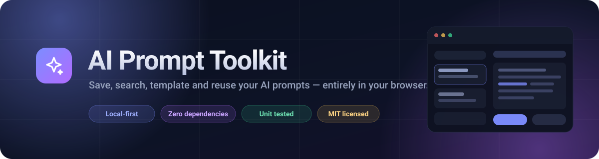

<div align="center">



**A fast, local-first prompt library that runs entirely in your browser.**
Save the prompts that actually work, find them in a keystroke, turn them into reusable templates.

[**Open the live app →**](https://msheez.github.io/ai-prompt-toolkit/)

[](https://github.com/Msheez/ai-prompt-toolkit/actions/workflows/ci.yml)
[](https://msheez.github.io/ai-prompt-toolkit/)
[](LICENSE)
[](package.json)
[](CHANGELOG.md)
[](tests)

</div>

---

## Why this exists

Good prompts end up scattered across notepads, chat histories, WhatsApp messages and
browser bookmarks — and then you rewrite them from memory. The AI Prompt Toolkit gives
them one home: a searchable library that opens instantly, works offline, and never sends
your prompts anywhere.

No account. No server. No tracking. No build step.

## Features

| | |
|---|---|
| 🔎 **Search that finds things** | One box searches titles, prompt text, categories and tags at once, ranks the best matches first, and highlights them in the results. Quoted `"exact phrases"` are supported. |
| 🧮 **Filters that stack** | Search **+** category **+** multiple tags **+** favourites, all combined with AND — plus a live result count and one-click **Clear filters**. |
| ⭐ **Favourites** | Star the prompts you reach for daily and filter down to them instantly. |
| 🧩 **Template variables** | Write `{{topic}}` or `{{tone|friendly}}` in a prompt, fill the blanks in the Preview tab, and copy the finished text. |
| 💾 **Autosave** | Changes are written to the browser as you type, with a visible save state. |
| ↩️ **Undo delete** | Deleting shows an undo toast for seven seconds instead of an unrecoverable confirm box. |
| ⌨️ **Keyboard first** | <kbd>Ctrl</kbd>+<kbd>K</kbd> command palette, <kbd>/</kbd> to search, <kbd>Ctrl</kbd>+<kbd>S</kbd> to save, <kbd>?</kbd> for the full list. |
| 🕘 **Version history** | Every save is remembered. Compare any version with the current text in a line diff, restore it (the current text is kept as a new version), or delete old ones. |
| 💼 **Backups you can trust** | One-click full backup (prompts + history + checksum). Importing shows a **preview first**, then offers five modes: merge, add new only, update existing, import as copies, or replace — with an undo copy for the risky one. |
| 🔁 **Automatic upgrades** | Data from every earlier version is migrated on first load, and never deleted. Data from a *newer* version is refused rather than damaged. |
| 📴 **Works offline** | Installable as an app. After the first visit it opens with no connection, and updates only when you click *Update*. |
| 🩺 **Recovery tools** | A read-only health check, a banner that pauses saving if stored data is damaged, and a reset that needs you to type `DELETE`. |
| 📄 **Export** | Prompts as JSON, or a readable Markdown file (drag a `.json` file anywhere on the page to import). |
| 🌓 **Dark & light themes** | Follows your system preference on first visit, then remembers your choice. |
| 📱 **Responsive** | Two-pane desktop layout collapses into a list ⇄ editor flow on phones. |
| 🔒 **Private & hardened** | Everything lives in your browser's `localStorage`. No account, no analytics, no cookies. A strict Content Security Policy blocks inline code and any request to another site, and tests fail if the app ever builds markup from text or calls the network. |

## Quick start

The app is plain HTML, CSS and JavaScript — there is nothing to install.

```bash
git clone https://github.com/Msheez/ai-prompt-toolkit.git
cd ai-prompt-toolkit
npm start            # serves http://localhost:8000 (Node 18+, no dependencies)
```

Prefer not to use Node? Any static server works, or just open `index.html` directly:

```bash
python -m http.server 8000
```

First run: click **Load 8 starter prompts** to see the toolkit with real content.

## Usage

<details>
<summary><strong>Create and organise prompts</strong></summary>

1. Click **New prompt** (or press <kbd>Ctrl</kbd>+<kbd>Shift</kbd>+<kbd>N</kbd>).
2. Give it a title, a category and a few comma-separated tags.
3. Write the prompt. It saves itself as you type.
4. Star it if it is one of your regulars.
</details>

<details>
<summary><strong>Turn a prompt into a reusable template</strong></summary>

Write placeholders in double braces, with an optional default after a pipe:

```text
Write a YouTube script about {{topic}}
for {{audience|complete beginners}}
in a {{tone}} tone.
```

Open the **Preview** tab, fill in the fields, and click **Copy filled**. The original
prompt keeps its placeholders, so you can reuse it forever.
</details>

<details>
<summary><strong>Back up and move your prompts</strong></summary>

**Settings → Create full backup** downloads prompts, version history and a checksum.
**Settings → Restore or import a file** (or drag a `.json` file onto the page) first shows a preview — how many
prompts, any warnings — and nothing changes until you pick a mode and confirm. The default
*Merge* keeps whichever copy of a prompt is newer, so importing twice never creates duplicates.
Details: [docs/STORAGE.md](docs/STORAGE.md).
</details>

<details>
<summary><strong>Go back to an earlier version of a prompt</strong></summary>

Open a prompt and choose the **History** tab. Pick a version to see what changed, then
**Restore**. Your current text is saved as a new version first, so restoring is never a
one-way door.
</details>

## Keyboard shortcuts

| Action | Shortcut |
|---|---|
| Command palette | <kbd>Ctrl</kbd>+<kbd>K</kbd> |
| New prompt | <kbd>Ctrl</kbd>+<kbd>Shift</kbd>+<kbd>N</kbd> |
| Focus search | <kbd>/</kbd> |
| Save | <kbd>Ctrl</kbd>+<kbd>S</kbd> |
| Copy prompt | <kbd>Ctrl</kbd>+<kbd>Shift</kbd>+<kbd>C</kbd> |
| Toggle favourite | <kbd>Ctrl</kbd>+<kbd>D</kbd> |
| Clear filters | <kbd>Esc</kbd> |
| Shortcut help | <kbd>?</kbd> |

## Project structure

```text
ai-prompt-toolkit/
├── index.html                  # the entire UI (markup + icon sprite + CSP)
├── sw.js                       # service worker (offline, versioned cache)
├── manifest.webmanifest        # makes the app installable
├── assets/
│   ├── css/                    # design tokens → base → components → layout
│   └── js/
│       ├── core/               # pure, unit-tested logic (no DOM)
│       │   ├── security.js     #   the one place untrusted input is checked
│       │   ├── schema.js       #   prompt shape, export, versions
│       │   ├── migrations.js   #   v1 → v2 → v3 upgrade ladder
│       │   ├── history.js      #   version history, diff, restore
│       │   ├── backup.js       #   backups, import preview, import modes
│       │   ├── health.js       #   read-only health check
│       │   ├── search.js       #   filtering, ranking, sorting, highlighting
│       │   ├── variables.js    #   {{placeholder}} templates
│       │   ├── library.js      #   add / edit / delete / duplicate / stats
│       │   ├── storage.js      #   localStorage with recovery and a memory fallback
│       │   └── starter-prompts.js
│       ├── pwa.js              # registers the service worker
│       └── app.js              # the only file that touches the DOM
├── tests/                      # node --test, zero dependencies
├── scripts/                    # dev server, build, site verifier, browser tests
├── .github/workflows/          # ci.yml (Node 18/20/22) and deploy.yml (GitHub Pages)
└── docs/                       # architecture, privacy, security, storage, deployment, roadmap
```

The rule that keeps this maintainable: **`core/` never touches the DOM, `app.js` never
makes decisions.** That is what makes 149 unit tests possible without a browser or a
testing framework.

📖 [Architecture](docs/ARCHITECTURE.md) · 🧭 [User flow](docs/USER-FLOW.md) · 💾 [Storage & backups](docs/STORAGE.md) · 🔒 [Privacy](docs/PRIVACY.md) · 🛡️ [Security](docs/SECURITY.md) · 🚀 [Deployment](docs/DEPLOYMENT.md) · 🗺️ [Roadmap](docs/ROADMAP.md)

## Development

```bash
npm test             # 149 unit tests (node:test, no dependencies)
npm run check        # verifies asset paths, icon ids and element ids, then tests
npm run build        # assembles the deployable site into dist/
npm run verify:site  # serves the site and requests every file it needs
npm run test:e2e     # 13 real-browser checks (needs Playwright + Chromium)
npm start            # local dev server on :8000
```

Every push and pull request runs the tests on Node 18, 20 and 22 via
[ci.yml](.github/workflows/ci.yml). Every push to `main` runs
[deploy.yml](.github/workflows/deploy.yml): tests → checks → build → verify → publish to GitHub Pages,
and a failure at any stage stops the deployment. See [docs/DEPLOYMENT.md](docs/DEPLOYMENT.md).

## Roadmap

| Version | Status | Highlights |
|---|---|---|
| v1 | ✅ Shipped | CRUD, categories, tags, search, copy, import/export |
| v2 | ✅ Shipped | Ranked multi-field search, stacked filters, favourites, sorting, variables, command palette, themes |
| v3.0 | ✅ Shipped | Version history: compare, restore, delete |
| v3.1 | ✅ Shipped | Full backups, import preview and modes, automatic migration, recovery tools |
| **v3.2** | ✅ **Current** | Security hardening (strict CSP, central validation), privacy docs, offline PWA, test → build → deploy pipeline |
| v3.3 | 🔜 Next | Archive, collections, richer prompt fields, more sort orders |
| v3.4 | 💭 Planned | IndexedDB storage with automatic migration |
| v4+ | 💭 Planned | Prompt builder, quality tools, optional AI providers (never a key in the frontend), semantic search, encryption, extension |

Nothing in the "Planned" rows exists yet — see the [feature matrix](docs/ROADMAP.md) for exactly what is built.

The full reasoning behind each stage lives in [docs/ROADMAP.md](docs/ROADMAP.md).

## Contributing

Pull requests are welcome — see [CONTRIBUTING.md](CONTRIBUTING.md) for the workflow,
coding conventions and how to add a test. Bug reports and feature ideas go in
[Issues](https://github.com/Msheez/ai-prompt-toolkit/issues/new/choose).

## Privacy

The toolkit stores prompts and their history in your browser's `localStorage`. It has no
account, no analytics, no cookies and makes no outbound requests; a Content Security Policy
enforces this in the browser. Backups are plain JSON and are **not encrypted** (encryption
is planned, not built), so keep secrets out of prompts. Clearing site data deletes your
prompts, so create a backup before you do. Full details: [docs/PRIVACY.md](docs/PRIVACY.md) ·
[docs/SECURITY.md](docs/SECURITY.md).

## License

[MIT](LICENSE) © Msheez and contributors.
