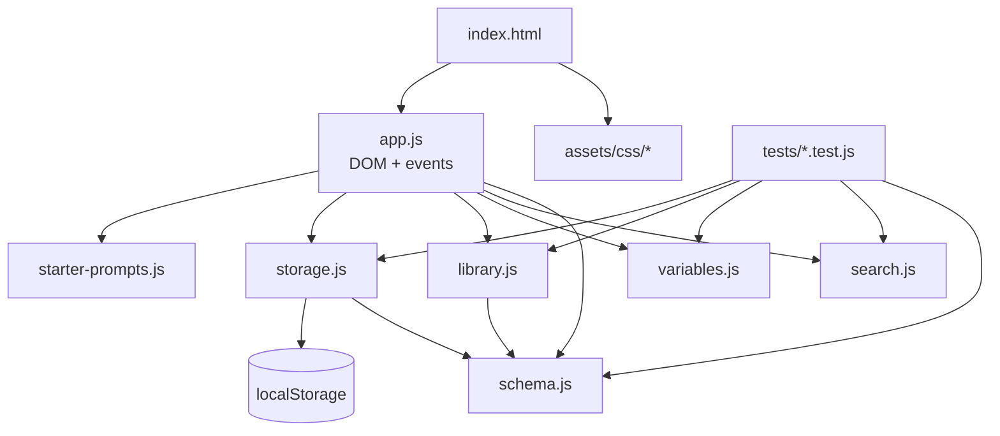
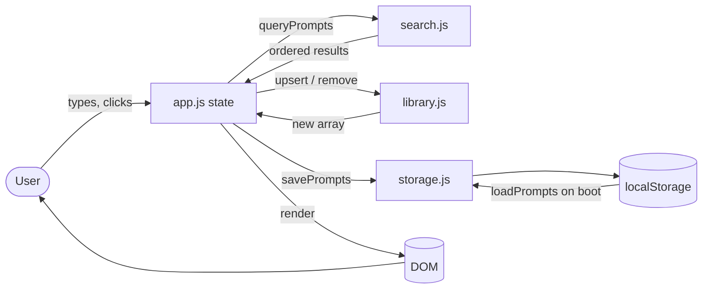
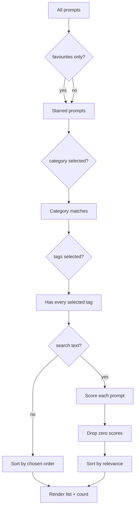
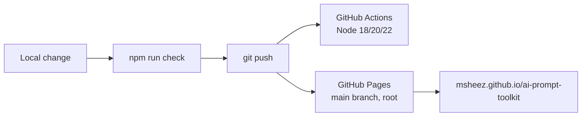

# Architecture & repository file map

A map of what every file does, how data moves through the app, and why it is
built this way.

---

## 1. The one rule

```text
assets/js/core/*   ->  decides things, never touches the DOM
assets/js/app.js   ->  touches the DOM, never decides things
```

Everything that can be wrong in an interesting way (what matches a search, how a
v1 backup is upgraded, what a filled template looks like) lives in `core/` as
pure functions. They run in Node, so they are covered by 58 unit tests that need
no browser and no test framework.

`app.js` is the only file that knows `document` exists. It reads state, draws it,
listens for events, and calls back into `core/`.

## 2. Repository file map

```text
ai-prompt-toolkit/
│
├── index.html                      Entire UI: markup, icon sprite, script tags
├── package.json                    Scripts only — zero runtime dependencies
├── README.md                       Project front page
├── CHANGELOG.md                    What changed in each version
├── CONTRIBUTING.md                 How to work on the project
├── CODE_OF_CONDUCT.md              Community expectations
├── SECURITY.md                     How to report a vulnerability
├── LICENSE                         MIT
├── .nojekyll                       Tell GitHub Pages to serve files as-is
├── .editorconfig                   Shared whitespace rules
├── .gitignore
│
├── assets/
│   ├── css/
│   │   ├── tokens.css              Design tokens + dark/light themes
│   │   ├── base.css                Reset, document shell, typography
│   │   ├── components.css          Buttons, fields, cards, dialogs, toasts
│   │   └── layout.css              Topbar, sidebar, workspace, responsive rules
│   │
│   ├── img/
│   │   └── favicon.svg             App mark
│   │
│   └── js/
│       ├── core/
│       │   ├── schema.js           Prompt shape, normalisation, import/export, merge
│       │   ├── search.js           Tokenising, ranking, filtering, sorting, highlighting
│       │   ├── variables.js        {{placeholder}} parsing, filling, preview segments
│       │   ├── library.js          Add, edit, delete, restore, duplicate, stats
│       │   ├── storage.js          localStorage wrapper, v1 → v2 migration, fallback
│       │   └── starter-prompts.js  The optional eight-prompt starter pack
│       └── app.js                  State, rendering, events, keyboard shortcuts
│
├── scripts/
│   ├── serve.js                    Dependency-free static dev server (npm start)
│   └── check-html.js               No-build sanity checks (npm run check)
│
├── tests/
│   ├── schema.test.js              Normalisation, export envelope, merge rules
│   ├── search.test.js              Ranking, combined filters, highlighting
│   ├── variables.test.js           Template parsing and filling
│   ├── library.test.js             Immutability, undo support, stats
│   ├── storage.test.js             Persistence, migration, corrupt data, private mode
│   └── starter-prompts.test.js     The shipped content is valid
│
├── docs/
│   ├── ARCHITECTURE.md             This file
│   ├── USER-FLOW.md                End-to-end user journeys
│   ├── ROADMAP.md                  Where the project is going
│   └── assets/banner.svg           README banner
│
└── .github/
    ├── workflows/ci.yml            Tests + checks on Node 18/20/22
    ├── ISSUE_TEMPLATE/             Bug report, feature request
    └── PULL_REQUEST_TEMPLATE.md
```

## 3. Module graph



Each `core/` file is a UMD module: in the browser it attaches itself to
`window.PromptToolkit`, in Node it is a normal CommonJS module. That is how the
same file runs in a `<script>` tag *and* under `node --test` with no bundler.

```js
// the pattern used by every core module
(function (global, factory) {
  if (typeof module === "object" && module.exports) module.exports = factory();
  else global.PromptToolkit.search = factory();
})(globalThis, function () { /* … */ });
```

## 4. Data flow



State lives in one object inside `app.js`:

```js
state = {
  prompts,          // the library, newest-first
  settings,         // theme + preferred sort
  filters,          // query, category, tags[], favoritesOnly, sort
  selectedId,       // the prompt in the editor
  dirty,            // are there unsaved keystrokes?
  tab,              // "write" | "preview"
  variableValues,   // what the user typed into the template fields
}
```

Rendering is top-down and idempotent: `render()` redraws the filter controls,
the list, the stats and the editor from `state`. The one exception is deliberate —
when `state.dirty` is true the editor inputs are left alone so a background
re-render can never overwrite what someone is typing.

## 5. The prompt object

```json
{
  "id": "9f2c…",
  "title": "YouTube video ideas",
  "category": "Content",
  "tags": ["youtube", "ideas"],
  "content": "Give me 10 creative video ideas about {{topic}}.",
  "notes": "Good warm-up prompt when planning a series.",
  "favorite": true,
  "usageCount": 4,
  "createdAt": "2026-03-01T10:00:00.000Z",
  "updatedAt": "2026-03-04T18:22:11.000Z"
}
```

`schema.normalizePrompt()` is the only way a prompt enters the system — from the
editor, from an import, or from storage. Anything missing gets a default,
anything too long is clipped, unknown fields are dropped, and v1 prompts (where
`tags` was the string `"a, b"`) are upgraded on the way in.

### Storage keys

| Key | Written by | Contents |
|---|---|---|
| `aiPromptToolkit.library.v2` | `storage.savePrompts` | `{app, schemaVersion, savedAt, prompts[]}` |
| `aiPromptToolkit.settings.v2` | `storage.saveSettings` | `{theme, sort, onboarded}` |
| `aiPromptToolkit.prompts.v1` | the original release | read once, migrated, then left untouched as a safety net |

If `localStorage` throws — private mode, blocked cookies, a sandboxed iframe —
`storage.js` silently swaps in an in-memory backend and the sidebar shows a
warning instead of the app breaking.

## 6. Search pipeline



Scoring, roughly: an exact title match is worth 120, a title prefix 90, a title
substring 70, a whole-word tag match 60, a category match 35, body text 20, and a
starred prompt gets a small bonus. Every search term must match *something*
(terms are ANDed), which is why `youtube email` returns nothing while
`youtube ideas` returns one prompt.

## 7. Rendering safety

No part of the app builds HTML from strings. Every node is created with
`document.createElement` and filled with `textContent`, including search
highlighting, which uses `search.highlight()` to return `{text, match}` segments
that become real `<mark>` elements. A prompt containing `<script>` is therefore
just text, and there is no `innerHTML` to audit.

## 8. Why no framework or build step

| Decision | Reason |
|---|---|
| No React/Vue | The whole UI is one list and one form; a framework would be more code than the app. |
| No bundler | GitHub Pages serves the repository as-is, so `git push` *is* the deploy. |
| No dependencies | Nothing to audit, nothing to update, the app still runs in five years. |
| UMD core modules | Lets the same files run in the browser and under `node --test`. |
| `npm run check` | Replaces what a bundler would catch: dead asset paths, missing icons, typo'd element ids. |

The trade-off is accepted deliberately: if this ever grows a backend or offline
sync, a build step can be added then, and `core/` will move across unchanged.

## 9. Deployment



GitHub Pages is configured to serve the `main` branch from `/`, which is why
`index.html` must stay at the repository root and why `.nojekyll` is present.
