# Roadmap

The guiding principle: **small feature → test → commit → document → next feature.**
Version numbers are milestones, not permission to break the app. A feature counts as done only when it has
working logic, persists across reload, handles errors, is tested and is documented.

Status key: ✅ shipped and tested · 🟡 partly there · 🔜 next · 💭 planned

## Where the project is: v3.2.0

Everything marked ✅ below is in the code and covered by `npm test` (unit) or `npm run test:e2e` (real browser).

### Feature matrix (audit of the repository)

| Area | Status | Notes |
|---|---|---|
| Create / edit / delete / duplicate / copy / favourite | ✅ | Delete has a 7-second undo |
| Archive / restore a prompt | 💭 | Not built. Delete + undo and version history cover the safety need for now |
| Extra prompt fields (description, language, author, source) | 💭 | Prompts have title, category, tags, note, text, favourite, usage count, version, dates |
| Search across title, text, category, tags | ✅ | Ranked, quoted phrases, live, case-insensitive |
| Filters: category, tags, favourites (stack with search) | ✅ | Clear-all, active-filter summary. Language/author/source filters need those fields first |
| Sorting: updated, created, A–Z, most used | ✅ | Oldest, least used, favourites-first not yet |
| Category / tag / collection management (rename, reorder, folders) | 💭 | Categories and tags are free text; no collections yet |
| Variables `{{name}}` with defaults, preview, fill-in, reset | ✅ | |
| Templates (as a feature) | 🟡 | 8 starter prompts; no separate template type or conversion yet |
| Usage tracking (count, "copied N×") | ✅ | Local only. No "last used" timestamp yet |
| **Version history** (snapshot, compare, restore, delete) | ✅ | v3.0. See [STORAGE.md](STORAGE.md) |
| **Import / export**: JSON, Markdown out; JSON in | ✅ | CSV/TXT not built |
| **Import modes + preview**: merge, add new, update, new copies, replace | ✅ | v3.1. Validation, warnings, safety copy |
| **Full backup / restore with checksum** | ✅ | v3.1 |
| **Data migration** from every earlier format (v1 → v2 → v3) | ✅ | v3.1. Never deletes the source; refuses newer data safely |
| **Recovery**: health check, damaged-data banner, set-aside copy, strong-confirm reset | ✅ | v3.1 |
| **Security hardening**: central input validation, strict CSP, no unsafe APIs | ✅ | v3.2. See [SECURITY.md](SECURITY.md) |
| **Privacy**: no network calls, no tracking, documented | ✅ | v3.2. See [PRIVACY.md](PRIVACY.md) |
| **PWA / offline**: service worker, manifest, installable, safe updates | ✅ | v3.2 |
| **Deployment**: test → check → build → verify → deploy | ✅ | v3.2. See [DEPLOYMENT.md](DEPLOYMENT.md) |
| Dark / light theme | ✅ | Follows the system on first visit |
| Command palette and keyboard shortcuts | ✅ | |
| Settings dialog | 🟡 | Theme, backup, privacy, storage health, reset. No language, default view or confirmation preferences |
| IndexedDB as primary store | 💭 | Uses `localStorage` (≈5 MB). The storage layer is isolated so it can be swapped; see [STORAGE.md](STORAGE.md) |
| Optional encryption | 💭 | **Not implemented.** Nothing in the UI claims it is |
| Prompt builder, quality tools | 💭 | |
| AI providers, playground, prompt testing | 💭 | No AI code exists in this version |
| Semantic search, workers | 💭 | |
| Browser extension, sharing, community library | 💭 | |
| Internationalisation | 💭 | UI strings are in the code, not in dictionaries yet |

## Milestones

| Milestone | Theme | Status |
|---|---|---|
| v1.0 – v1.4 | Prompt library, search, tags, favourites, import/export, themes | ✅ (v1/v2 releases) |
| v2.0 – v2.2 | Fast search, filters, variables | ✅ |
| v2.3 | Templates | 🟡 starter pack only |
| v2.4 | Collections | 💭 |
| v2.5 | Usage tracking | ✅ (count) |
| **v3.0** | **Version history** | ✅ |
| **v3.1** | **Backup / restore / data migration** | ✅ |
| **v3.2** | **Security + privacy + production hardening, PWA, deploy pipeline** | ✅ |
| v3.3 | Archive, collections, richer fields (description/language/author/source), more sort orders | 🔜 |
| v3.4 | IndexedDB storage with automatic migration from `localStorage` | 💭 |
| v4.0 | Prompt builder | 💭 |
| v4.1 | Prompt quality tools (local heuristics only) | 💭 |
| v4.2 – v4.4 | AI provider architecture, playground, prompt testing (all optional) | 💭 |
| v5.0 – v5.2 | Semantic search, workers, optional Web Crypto encryption | 💭 |
| v6.0 – v6.1 | Browser extension, shareable prompts | 💭 |
| v7.0+ | Community library, workflows, i18n, full workspace | 💭 |

### Principles every milestone must keep

Local-first · privacy-first · offline-first · no account · no tracking · no required backend · no forced AI ·
no fake features · no destructive migration · security validation in one place.

> **Security note for AI milestones.** An API key typed into a public static page is readable by any script on
> that page. Provider calls from the browser will stay opt-in and clearly labelled, with a user-controlled proxy
> as the recommended path. Encryption will only be advertised once it actually exists.

## Deliberately not planned

| Idea | Why not |
|---|---|
| Rewriting in React/Vue | The app is one list and one form; a framework would add more code than it removes |
| A required login | Local-first is the product, not a limitation |
| Analytics | The repo promises no tracking, and that promise is the feature |
| A hosted backend by default | It turns a free static site into something with running costs and user data to protect |

## How a version gets shipped

```mermaid
flowchart LR
    IDEA[Issue describing the need] --> CORE[Logic in assets/js/core]
    CORE --> TESTS[Unit tests for it]
    TESTS --> UI[Wire it up in app.js]
    UI --> CHECK[npm run check + test:e2e]
    CHECK --> PR[Pull request]
    PR --> CI[CI on Node 18/20/22]
    CI --> MERGE[Merge to main]
    MERGE --> PAGES[Deploy workflow publishes to GitHub Pages]
    PAGES --> DOC[CHANGELOG + docs updated]
```

Have an opinion on what should come next? Open an
[issue](https://github.com/Msheez/ai-prompt-toolkit/issues/new/choose) — roadmap items are negotiable, the order especially.
