# Roadmap

The guiding principle: **small feature → test → commit → document → next feature.**
A visible, incremental history is worth more than a big-bang release.

Status key: ✅ shipped · 🔜 next · 💭 planned · 🤔 undecided

---

## ✅ v1 — The notebook

The first working release: a prompt is something you can create, keep and find again.

- Create, edit and delete prompts
- Category and free-text tags
- Single-field search
- Copy to clipboard
- JSON import/export
- `localStorage` persistence, no accounts

## ✅ v2 — Finding things

Search stopped being a toy.

- Search across **title, prompt text, category and tags** at once
- Relevance ranking (title beats tag beats body) with quoted `"phrase"` support
- Search **combined** with the category filter (AND, not OR)
- **Clear filters** button and <kbd>Esc</kbd> shortcut
- Live result count and an active-filter summary
- Matched terms highlighted in the results

## ✅ v3 — Organising a real library

Once there are thirty prompts, order matters.

- ⭐ Favourites, with a favourites-only filter
- Clickable tag chips with counts, stacked with AND
- Sorting: recently updated, recently created, A–Z, most used
- Duplicate a prompt
- Delete with a 7-second **undo**
- Library stats: prompts, categories, tags, starred
- Starter pack so a new library is never empty

## ✅ v4 — From notebook to tool

The release that made the toolkit worth opening every day.

- `{{variables}}` with inline defaults (`{{tone|friendly}}`)
- Preview tab with one input per placeholder and live filled output
- "Copy filled" that warns about blanks, plus a usage counter
- <kbd>Ctrl</kbd>+<kbd>K</kbd> command palette
- Dark/light themes following the system preference
- Autosave with a visible save state
- Markdown export, drag-and-drop import, versioned JSON schema with v1 migration
- Full keyboard shortcut set and an in-app shortcut dialog
- 58 unit tests + no-build sanity checks running in CI on Node 18/20/22

## 🔜 v5 — Scale and polish

For libraries that outgrow a single flat list.

- [ ] Folders or prompt collections (tags handle ~50 prompts; folders handle 500)
- [ ] Bulk actions: multi-select, bulk tag, bulk delete, bulk export
- [ ] Prompt version history with a diff and one-click restore
- [ ] Pin prompts to the top of the library
- [ ] Install as an app (PWA + service worker) so it works fully offline
- [ ] Soft-delete "Trash" instead of permanent deletion
- [ ] CSV import for people migrating from a spreadsheet

## 💭 v6 — Running prompts

Only worth doing once it can be done safely.

- [ ] Optional AI provider integration (OpenAI, Anthropic, Ollama, …)
- [ ] Bring-your-own-key, stored locally, never committed or synced
- [ ] A response pane next to the prompt, with the result attachable to the prompt
- [ ] Prompt comparison: run two variants side by side

> **Security note.** An API key pasted into a public static site is readable by
> any script on the page. Direct provider calls from the browser will stay
> opt-in and clearly labelled, and the recommended path will be a small proxy
> the user controls. This is exactly why v6 is not v2.

## 💭 v7 — Beyond one browser

- [ ] Optional account and cloud sync (local-first stays the default)
- [ ] Shareable read-only prompt links
- [ ] Community prompt packs, installable with one click
- [ ] Browser extension: capture a prompt from any page, paste into any chat box

## 🤔 Deliberately not planned

| Idea | Why not |
|---|---|
| Rewriting in React/Vue | The app is one list and one form; a framework would add more code than it removes |
| A required login | Local-first is the product, not a limitation |
| Analytics | The repo promises no tracking, and that promise is the feature |
| A hosted backend by default | It turns a free static site into something with running costs and user data to protect |

## How a version gets shipped

```mermaid
flowchart LR
    IDEA[Issue describing the need] --> CORE[Logic in assets/js/core]
    CORE --> TESTS[Unit tests for it]
    TESTS --> UI[Wire it up in app.js]
    UI --> CHECK[npm run check]
    CHECK --> PR[Pull request]
    PR --> CI[CI on Node 18/20/22]
    CI --> MERGE[Merge to main]
    MERGE --> PAGES[GitHub Pages redeploys]
    PAGES --> DOC[CHANGELOG + docs updated]
```

Have an opinion on what should come next? Open an
[issue](https://github.com/Msheez/ai-prompt-toolkit/issues/new/choose) — roadmap
items are negotiable, the order especially.
