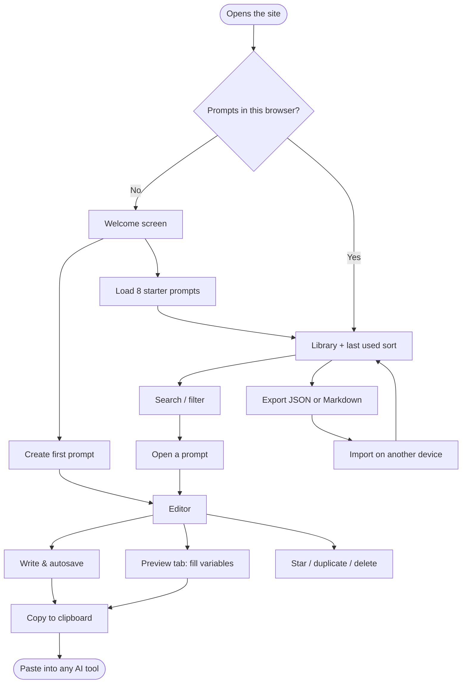
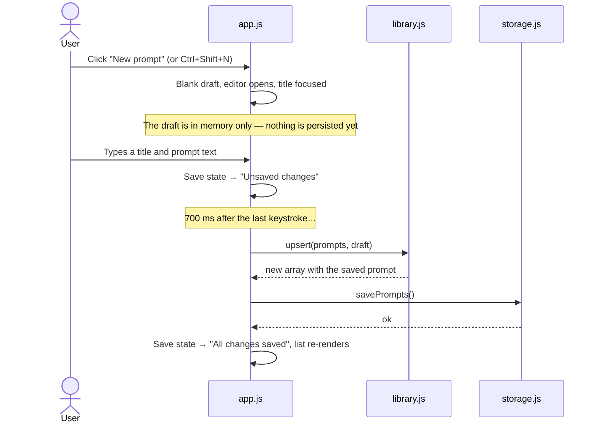
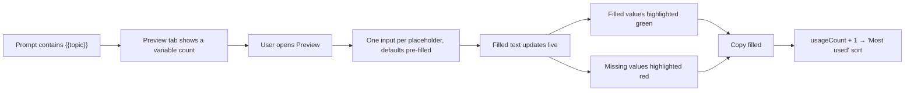
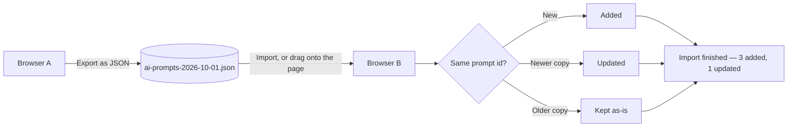

# End-to-end user flow

How a person actually moves through the AI Prompt Toolkit, from the first visit
to a daily habit. Each flow lists what the user does, what the app does, and
where that behaviour is implemented.

---

## 1. The whole journey at a glance



## 2. First visit

| Step | What the user sees | What happens underneath |
|---|---|---|
| 1 | The page loads in well under a second | No framework, no network requests after the four CSS and seven JS files |
| 2 | Dark or light theme, matching their OS | `init()` reads `prefers-color-scheme` only when no setting is stored yet |
| 3 | A welcome screen explaining the app | Shown because `state.prompts` is empty |
| 4 | Two buttons: **Create your first prompt** and **Load 8 starter prompts** | An empty library is a dead end; the starter pack gives something to explore |
| 5 | Prompts appear, the sidebar fills with categories, tags and counts | `schema.mergePrompts` → `storage.savePrompts` → `render()` |

Returning visits skip straight to the library, with the previous sort order
restored from `aiPromptToolkit.settings.v2`.

**Upgrading from v1:** if the browser still holds `aiPromptToolkit.prompts.v1`,
those prompts are converted to the new schema on first load, written to the new
key, and a toast confirms how many were upgraded. The old key is left in place
as a safety net.

## 3. Creating a prompt



Abandoning a new prompt leaves nothing behind: a draft with no title and no text
is dropped as soon as the user navigates away (`pruneBlankDrafts`).

## 4. Finding a prompt

Three routes, depending on how much the user remembers:

```mermaid
flowchart LR
    Q([I need a prompt]) --> R1{Do I remember the name?}
    R1 -->|Yes| CK[Ctrl+K, type, Enter]
    R1 -->|Roughly| SEARCH[/ then type in the sidebar]
    R1 -->|No| BROWSE[Filter by category, tag or favourites]

    CK --> OPEN[Prompt opens in the editor]
    SEARCH --> OPEN
    BROWSE --> OPEN
```

**What a search actually does** — searching `ai` and selecting the category
*Content Creation*:

```text
ALL PROMPTS
     │  favourites filter (off)
     ▼
  every prompt
     │  category = "Content Creation"
     ▼
  2 prompts
     │  tag filters (none selected)
     ▼
  2 prompts
     │  must contain "ai" in title, text, category or tags
     ▼
  1 prompt  → ranked, highlighted, counted as "1 prompt"
```

The sidebar always shows the result count and a one-line summary of the active
filters (`Search: "ai" · Category: Content Creation`), so it is never a mystery
why a prompt is missing. **Clear filters** — or <kbd>Esc</kbd> — resets
everything except the sort order.

## 5. Using a template



The stored prompt always keeps its `{{placeholders}}`; only the copied text is
filled in. If a placeholder is still empty the toast says so rather than
silently copying a half-finished prompt.

## 6. Editing, starring, duplicating, deleting

| Action | Flow | Safety net |
|---|---|---|
| Edit | Type → autosave after 700 ms → "All changes saved" | <kbd>Ctrl</kbd>+<kbd>S</kbd> forces an immediate save; closing the tab mid-edit flushes first |
| Star | Click the star in the list or the editor | Favourites never change `updatedAt`, so starring does not reorder the list |
| Duplicate | Editor → duplicate icon | The copy is inserted right after the original and opened |
| Delete | Editor → bin icon → confirm dialog | A toast offers **Undo** for 7 seconds and restores it to the same position |
| Delete everything | Library menu → Delete everything | Confirm dialog that states the exact number and suggests exporting first |

## 7. Backup and moving between devices



Because the merge is id-based and timestamp-aware, importing the same file twice
changes nothing — there is no duplicate explosion. **Export as Markdown**
produces a human-readable document instead, for sharing or printing.

## 8. On a phone

The desktop layout is two panes side by side. Below 780 px it becomes two
screens:

```text
   LIBRARY SCREEN                    EDITOR SCREEN
┌───────────────────────┐        ┌───────────────────────┐
│ Search                │        │ ←  Title        ★ ⧉ 🗑 │
│ Category | Sort       │        │ Category | Tags       │
│ ★ Favourites  ✕ Clear │  tap   │ Write | Preview       │
│ #tags #tags           │ ─────► │                       │
│ 7 prompts             │        │  prompt text…         │
│ ▸ YouTube ideas       │ ◄───── │                       │
│ ▸ Email writer        │  back  │ Saved   Copy  Save    │
└───────────────────────┘        └───────────────────────┘
```

Selecting a prompt swaps to the editor (`body.is-editing`), and the back arrow
returns to the list. Nothing is hidden behind a hamburger menu.

## 9. When things go wrong

| Situation | What the user gets |
|---|---|
| Private browsing / storage blocked | The app still works in memory and the sidebar warns that prompts will not survive the tab |
| Storage quota exceeded | A toast: "Could not save — browser storage is full or blocked" |
| Corrupt or hand-edited JSON in storage | Ignored; the app starts with an empty library instead of a blank page |
| Importing a non-backup file | A toast naming the problem: not valid JSON / no prompts found / nothing readable |
| Clipboard blocked by the browser | Falls back to a hidden textarea and `execCommand`, then reports honestly if that fails too |
| Closing the tab with unsaved edits | The pending autosave is flushed, and the browser confirms only if something is genuinely unsaved |

## 10. Accessibility notes

- Every control is reachable by keyboard, with a visible focus ring.
- The star in each list row is a real button with `aria-pressed`, not a decoration.
- Tabs use `role="tablist"`/`aria-selected`; dialogs are native `<dialog>` elements with focus trapping and <kbd>Esc</kbd> to close.
- A skip link jumps straight to the editor.
- Toasts live in an `aria-live="polite"` region, so results are announced.
- `prefers-reduced-motion` disables every animation.
